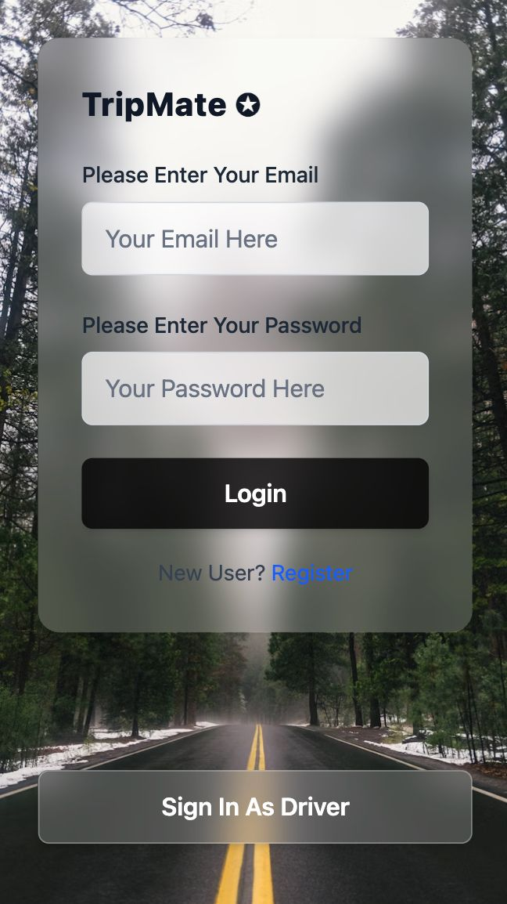
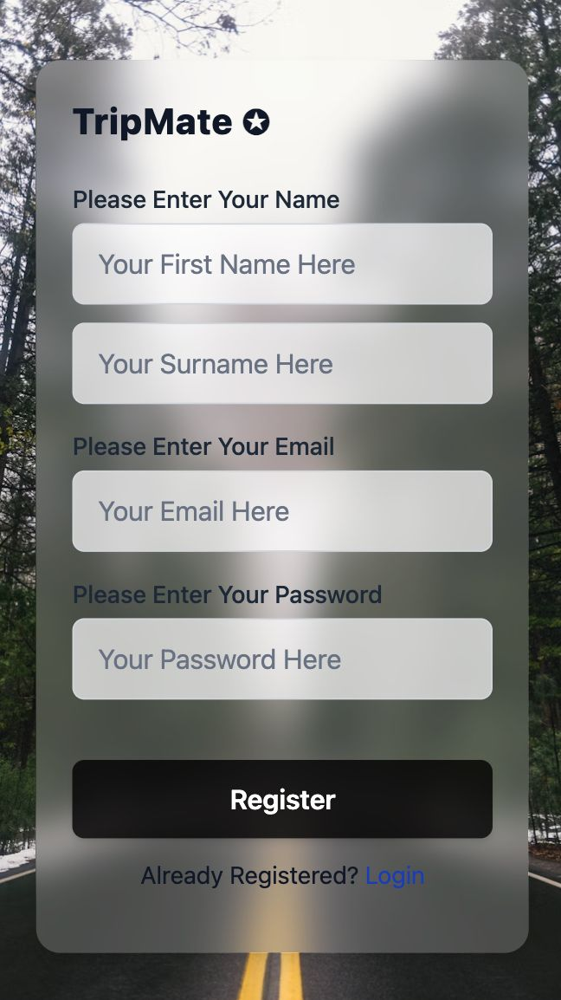
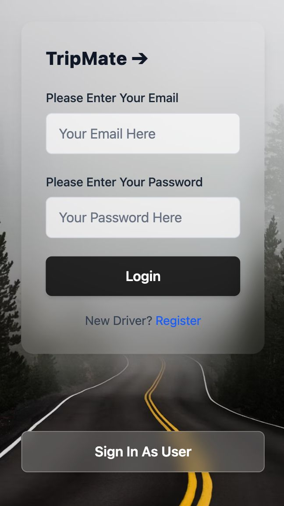
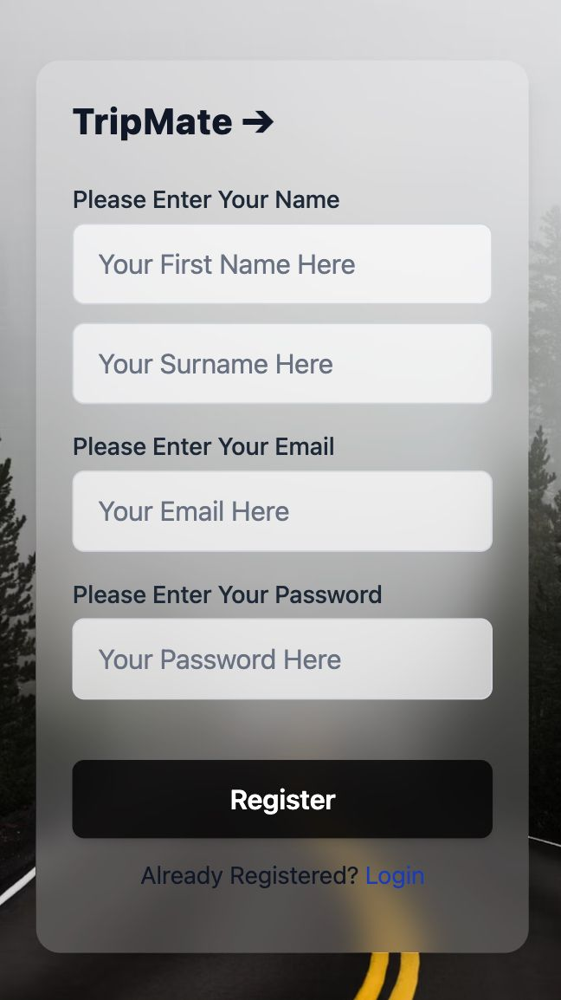

# TripMate Frontend

A React frontend for **TripMate**, a travel companion app providing user and driver authentication interfaces with a clean, glassmorphic design.

---

## Table of Contents

- [Project Overview](#project-overview)  
- [Tech Stack](#tech-stack)  
- [Folder Structure](#folder-structure)  
- [Pages Overview](#pages-overview)  
- [Getting Started](#getting-started)  
- [Usage](#usage)  
- [Future Improvements](#future-improvements)  

---

## Project Overview

TripMate is a travel application focused on connecting users and drivers through a simple and elegant UI. The frontend is built in React and uses React Router for client-side navigation. The app currently supports:

- User login and signup  
- Driver login and signup  
- A welcoming home page  

All forms feature glassmorphism styling and use Tailwind CSS for responsive UI components.

---

## Tech Stack

- **React** — UI library  
- **React Router DOM** — Routing  
- **Tailwind CSS** — Utility-first CSS framework  
- **JavaScript (ES6+)**  
- **Unsplash** images used for backgrounds  

---

## Folder Structure

```
src/
 ├─ assets/               # Static assets (background images)
 ├─ pages/                # React components for pages
 │   ├─ Home.jsx
 │   ├─ UserLogin.jsx
 │   ├─ UserSignup.jsx
 │   ├─ DriverLogin.jsx
 │   └─ DriverSignup.jsx
 ├─ App.jsx               # Main app component with routes
 └─ index.js              # React DOM rendering
```

---

## Pages Overview

### 1. Home (`/`)  
- Landing page with app branding  
- Background image with glassmorphic card introducing TripMate  
- Button to navigate to User Login  

### 2. UserLogin (`/login`)  
- Login form for regular users  
- Fields: Email, Password  
- Submit button to log in  
- Link to User Signup page  
- Button to switch to Driver Login  

### 3. UserSignup (`/signup`)  
- Registration form for new users  
- Fields: First Name, Last Name, Email, Password  
- Submit button to register  
- Link to User Login page  

### 4. DriverLogin (`/driver-login`)  
- Login form for drivers  
- Fields: Email, Password  
- Submit button to log in  
- Link to Driver Signup page  
- Button to switch to User Login  

### 5. DriverSignup (`/driver-signup`)  
- Registration form for new drivers  
- Fields: First Name, Last Name, Email, Password  
- Submit button to register  
- Link to Driver Login page  

---

## Getting Started

### Prerequisites

- Node.js (v14 or later)  
- npm or yarn package manager  

### Installation

1. Clone the repo  
```bash
git clone <repository-url>
cd tripmate-frontend
```

2. Install dependencies  
```bash
npm install
# or
yarn install
```

3. Run the development server  
```bash
npm start
# or
yarn start
```

4. Open your browser and visit `http://localhost:3000`

---

## Usage

- Navigate the routes:  
  - `/` for Home  
  - `/login` for User Login  
  - `/signup` for User Signup  
  - `/driver-login` for Driver Login  
  - `/driver-signup` for Driver Signup  

- Use the forms to simulate login and signup. (Currently form submission logs data to local state; backend integration is pending.)

- Switch between user and driver modes via provided buttons and links.

---

## Future Improvements

- Connect forms to backend API for real authentication  
- Add form validation and error handling  
- Add context or global state for user sessions  
- Implement password reset and verification flows  
- Add dashboard pages for users and drivers  
- Responsive and accessibility improvements  

---

## Screenshots

  
  
  
  
  
---

Feel free to reach out if you want me to help with the backend integration or enhance any frontend feature!
